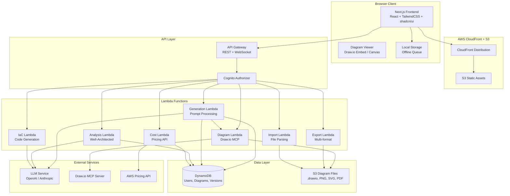
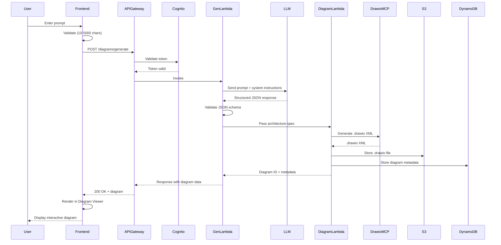

# Design Document

## Overview

The AWS Architecture Generator is a full-stack web application that transforms natural language descriptions into professional AWS architecture diagrams. The system orchestrates three core pipelines:

1. **Prompt-to-Diagram Pipeline**: User prompt → LLM interpretation → Structured JSON → Draw.io MCP rendering → Interactive diagram
2. **Analysis Pipeline**: Diagram state → Architecture analysis → Cost estimation → Best practice recommendations
3. **Persistence Pipeline**: Diagram edits → Autosave → Version history → Multi-format export

The application follows a clean client-server architecture with a Next.js frontend (React + TypeScript + TailwindCSS + shadcn/ui) communicating with serverless AWS backend services (API Gateway + Lambda + DynamoDB + S3). Authentication is handled by AWS Cognito, and the LLM integration supports both OpenAI GPT-5.5 and Claude Sonnet models.

### Key Design Decisions

| Decision | Rationale |
|----------|-----------|
| Next.js App Router | Server-side rendering for initial load performance, API routes for BFF pattern, built-in code splitting |
| Draw.io MCP Server for diagram generation | Produces native .drawio XML with official AWS icons, supports complex layouts |
| DynamoDB for metadata + S3 for files | Cost-effective serverless storage; DynamoDB for fast queries, S3 for large diagram files |
| Streaming LLM responses | Reduces perceived latency during generation; user sees progress |
| Client-side diagram editing | Responsive editing without round-trips; sync on save |
| Exponential backoff with retry | Resilience against transient LLM and service failures |

## Architecture

### System Architecture Diagram



### Request Flow: Prompt to Diagram



## Components and Interfaces

### Frontend Components

| Component | Responsibility | Key Dependencies |
|-----------|---------------|-----------------|
| `AppLayout` | Shell with navigation bar, theme toggle, auth state | Next.js App Router, shadcn/ui |
| `PromptInput` | Text area with validation, character count, submit | React Hook Form, zod |
| `DiagramCanvas` | Interactive draw.io embed with pan/zoom/edit | Draw.io embed API |
| `TemplateGallery` | Browse, search, filter templates | shadcn/ui Cards, search |
| `AnalysisPanel` | Display recommendations grouped by category | Collapsible panels |
| `CostPanel` | Show per-service cost breakdown, adjustable params | Data tables, sliders |
| `ExportDialog` | Format selection, options, download trigger | shadcn/ui Dialog |
| `VersionHistory` | Chronological list, restore, compare | Timeline component |
| `SettingsPage` | User preferences, theme, region, model | Form controls |
| `AuthProvider` | Cognito integration, token management, refresh | AWS Amplify Auth |

### API Endpoints

| Method | Path | Lambda | Description |
|--------|------|--------|-------------|
| POST | `/api/diagrams/generate` | GenLambda | Generate diagram from prompt |
| POST | `/api/diagrams/import` | ImportLambda | Import .drawio file |
| GET | `/api/diagrams/:id` | DiagramLambda | Get diagram metadata + presigned URL |
| PUT | `/api/diagrams/:id` | DiagramLambda | Update diagram (autosave) |
| DELETE | `/api/diagrams/:id` | DiagramLambda | Delete diagram |
| GET | `/api/diagrams/:id/versions` | DiagramLambda | List version history |
| POST | `/api/diagrams/:id/versions` | DiagramLambda | Create named version |
| PUT | `/api/diagrams/:id/versions/:vid/restore` | DiagramLambda | Restore version |
| POST | `/api/diagrams/:id/export` | ExportLambda | Export to format |
| GET | `/api/diagrams/:id/analysis` | AnalysisLambda | Get architecture analysis |
| GET | `/api/diagrams/:id/cost` | CostLambda | Get cost estimate |
| PUT | `/api/diagrams/:id/cost` | CostLambda | Update cost parameters |
| POST | `/api/diagrams/:id/iac` | IaCLambda | Generate IaC code |
| GET | `/api/templates` | TemplateLambda | List templates |
| POST | `/api/templates` | TemplateLambda | Save custom template |
| GET | `/api/user/dashboard` | UserLambda | Get dashboard data |

### Key Interfaces (TypeScript)

```typescript
// Architecture specification from LLM
interface ArchitectureSpec {
  id: string;
  name: string;
  description: string;
  region: string;
  services: ServiceNode[];
  connections: Connection[];
  groups: ResourceGroup[];
  metadata: ArchitectureMetadata;
}

interface ServiceNode {
  id: string;
  type: AWSServiceType;    // e.g., 'ec2', 'lambda', 's3'
  label: string;
  properties: Record<string, string>;
  groupId?: string;        // VPC, subnet, AZ reference
  position?: { x: number; y: number };
}

interface Connection {
  id: string;
  sourceId: string;
  targetId: string;
  label?: string;
  protocol?: string;       // e.g., 'HTTPS', 'TCP', 'gRPC'
  port?: number;
  bidirectional?: boolean;
}

interface ResourceGroup {
  id: string;
  type: 'region' | 'vpc' | 'subnet' | 'availability-zone' | 'security-group';
  label: string;
  parentId?: string;       // For nested groups (subnet inside VPC)
  children: string[];      // ServiceNode IDs
}

interface ArchitectureMetadata {
  prompt: string;
  generatedAt: string;
  llmModel: string;
  templateId?: string;
}
```

```typescript
// Diagram generation request/response
interface GenerateDiagramRequest {
  prompt: string;                    // 10-5000 characters
  templateId?: string;               // Optional starting template
  preferences?: GenerationPreferences;
}

interface GenerationPreferences {
  region: string;                    // AWS region
  layoutOrientation: 'horizontal' | 'vertical';
  includeAnalysis: boolean;
  includeCostEstimate: boolean;
}

interface GenerateDiagramResponse {
  diagramId: string;
  drawioXml: string;                 // .drawio XML content
  architectureSpec: ArchitectureSpec;
  explanation: ArchitectureExplanation;
  analysis?: ArchitectureAnalysis;
  costEstimate?: CostEstimate;
}
```

```typescript
// Architecture Analysis
interface ArchitectureAnalysis {
  wellArchitected: WellArchitectedAssessment;
  recommendations: Recommendation[];
  missingComponents: MissingComponent[];
}

interface WellArchitectedAssessment {
  pillars: PillarAssessment[];
}

interface PillarAssessment {
  pillar: 'operational-excellence' | 'security' | 'reliability' 
        | 'performance-efficiency' | 'cost-optimization' | 'sustainability';
  status: 'no-gaps' | 'gaps-found';
  summary: string;
}

interface Recommendation {
  id: string;
  category: 'security' | 'high-availability' | 'cost-optimization';
  severity: 'critical' | 'recommended' | 'optional';
  title: string;
  description: string;
  affectedServices: string[];        // ServiceNode IDs
}

interface MissingComponent {
  type: string;
  severity: 'critical' | 'recommended' | 'optional';
  reason: string;
  suggestedService: AWSServiceType;
}
```

```typescript
// Cost Estimation
interface CostEstimate {
  totalMonthlyCost: number;          // USD, 2 decimal places
  services: ServiceCost[];
  assumptions: UsageAssumptions;
}

interface ServiceCost {
  serviceId: string;
  serviceName: string;
  serviceType: AWSServiceType;
  monthlyCost: number;               // USD, 2 decimal places
  available: boolean;                 // false if pricing unavailable
}

interface UsageAssumptions {
  computeHoursPerMonth: number;      // default: 730
  requestsPerMonth: number;          // default: 1_000_000
  dataTransferGB: number;            // default: 100
  storageGB: number;                 // default: 50
}
```

```typescript
// Export Service
interface ExportRequest {
  diagramId: string;
  format: 'drawio' | 'png' | 'svg' | 'pdf' | 'json' | 'markdown';
  options?: ExportOptions;
}

interface ExportOptions {
  pngDpi?: number;                   // default: 300
  pdfPageSize?: 'a4' | 'letter' | 'a3';
}

interface ExportResponse {
  downloadUrl: string;               // Pre-signed S3 URL
  expiresAt: string;                 // URL expiry timestamp
  format: string;
  fileSizeBytes: number;
}
```

```typescript
// Version History
interface DiagramVersion {
  versionId: string;
  diagramId: string;
  name: string;                      // User-provided or "Autosave"
  createdAt: string;
  createdBy: string;
  isAutosave: boolean;
  s3Key: string;                     // Reference to .drawio file in S3
}

// IaC Generation
interface IaCRequest {
  diagramId: string;
  format: 'terraform' | 'cdk-typescript' | 'cloudformation';
}

interface IaCResponse {
  code: string;
  format: string;
  warnings: string[];                // Unsupported resources
  resourceCount: number;
}
```

### LLM System Prompt Strategy

The Generation Lambda uses a structured system prompt to ensure the LLM returns valid JSON:

```typescript
const SYSTEM_PROMPT = `You are an AWS Solutions Architect assistant. Given a natural language 
description of an AWS architecture, produce a JSON object conforming to the ArchitectureSpec 
schema. Rules:
1. Use only official AWS service types from the supported registry
2. Group resources by VPC, subnet, and AZ when specified
3. Include all necessary connections with protocols
4. Mark unrecognized services with type "generic"
5. Respond ONLY with valid JSON, no markdown or explanation`;
```

### Supported AWS Services Registry

The system maintains a registry of ~80 supported AWS service types with their official icon identifiers for Draw.io rendering. Services not in the registry are rendered as generic nodes with review annotations (per Requirement 2.5).

## Data Models

### DynamoDB Table Designs

**Table: Diagrams**

| Attribute | Type | Key | Description |
|-----------|------|-----|-------------|
| PK | String | Partition Key | `USER#{userId}` |
| SK | String | Sort Key | `DIAGRAM#{diagramId}` |
| diagramId | String | GSI1-PK | UUID |
| name | String | | User-provided diagram name |
| prompt | String | | Original generation prompt |
| architectureSpec | String | | JSON architecture specification |
| s3Key | String | | S3 key for .drawio file |
| templateId | String | | Source template ID if applicable |
| createdAt | String | | ISO 8601 timestamp |
| updatedAt | String | | ISO 8601 timestamp |
| serviceCount | Number | | Number of services in diagram |
| status | String | | `generating` / `ready` / `error` |
| TTL | Number | | Optional expiry for cleanup |

**Table: Versions**

| Attribute | Type | Key | Description |
|-----------|------|-----|-------------|
| PK | String | Partition Key | `DIAGRAM#{diagramId}` |
| SK | String | Sort Key | `VERSION#{timestamp}#{versionId}` |
| versionId | String | | UUID |
| name | String | | Label or "Autosave" |
| createdBy | String | | userId |
| isAutosave | Boolean | | true for autosaves |
| s3Key | String | | S3 key for version snapshot |
| createdAt | String | | ISO 8601 timestamp |

**Table: Templates**

| Attribute | Type | Key | Description |
|-----------|------|-----|-------------|
| PK | String | Partition Key | `TEMPLATE#{templateId}` |
| SK | String | Sort Key | `META` |
| templateId | String | | UUID |
| name | String | | Template name |
| description | String | | 50-500 char description |
| category | String | | Template category |
| useCases | List | | At least 2 use case strings |
| isBuiltIn | Boolean | | true for system templates |
| ownerId | String | | userId for custom templates |
| s3Key | String | | S3 key for template .drawio |
| createdAt | String | | ISO 8601 timestamp |

**GSI: UserTemplates**
- PK: `ownerId`
- SK: `createdAt`
- Purpose: Query user's custom templates

### S3 Bucket Structure

```
s3://arch-generator-files/
├── diagrams/
│   └── {userId}/
│       └── {diagramId}/
│           ├── diagram.drawio        # Current version
│           ├── exports/
│           │   ├── diagram.png
│           │   ├── diagram.svg
│           │   └── diagram.pdf
│           └── versions/
│               └── {versionId}.drawio
├── templates/
│   ├── built-in/
│   │   ├── three-tier-web.drawio
│   │   ├── serverless-api.drawio
│   │   └── ...
│   └── custom/
│       └── {userId}/
│           └── {templateId}.drawio
└── imports/
    └── {userId}/
        └── {uploadId}.drawio
```

### Offline Queue Schema (Local Storage)

```typescript
interface OfflineQueueEntry {
  id: string;
  timestamp: string;
  action: 'save' | 'autosave' | 'export' | 'delete';
  endpoint: string;
  payload: unknown;
  retryCount: number;
}
```


## Correctness Properties

*A property is a characteristic or behavior that should hold true across all valid executions of a system — essentially, a formal statement about what the system should do. Properties serve as the bridge between human-readable specifications and machine-verifiable correctness guarantees.*

### Property 1: Valid Prompt Routing

*For any* string with length between 10 and 5000 characters, the Generator SHALL forward it to the LLM_Service; and *for any* string with length less than 10 or greater than 5000 characters, the Generator SHALL reject it with a validation error without calling the LLM_Service.

**Validates: Requirements 1.1, 1.7, 1.8**

### Property 2: LLM Response Validation and Routing

*For any* LLM response, if it conforms to the ArchitectureSpec JSON schema then it SHALL be forwarded to the Diagram_Engine; if it does not conform to the schema then the Generator SHALL trigger the error path without forwarding to the Diagram_Engine.

**Validates: Requirements 1.2, 1.4**

### Property 3: Retry Behavior on Timeout

*For any* sequence of LLM_Service timeout responses, the Generator SHALL retry up to 2 additional times (3 total attempts), and if all attempts time out, it SHALL display a timeout error. If any attempt succeeds, it SHALL use that response.

**Validates: Requirements 1.6**

### Property 4: Diagram Engine Produces Well-Formed Output

*For any* valid ArchitectureSpec JSON input, the Diagram_Engine SHALL produce output that is well-formed XML conforming to the .drawio schema. *For any* schema-invalid JSON input, the Diagram_Engine SHALL reject it with an error without producing partial output.

**Validates: Requirements 2.1, 2.7**

### Property 5: Service Rendering Correctness

*For any* service node in an ArchitectureSpec, if the service type exists in the supported service registry then the output .drawio XML SHALL contain the corresponding official AWS icon style; if the service type does not exist in the registry then the output SHALL contain a generic node with a review annotation.

**Validates: Requirements 2.2, 2.5**

### Property 6: Container Grouping Correctness

*For any* ArchitectureSpec containing resource groups (VPC, subnet, AZ, region), the generated .drawio XML SHALL nest service nodes inside their declared group containers with correct parent-child relationships matching the input specification.

**Validates: Requirements 2.3**

### Property 7: Node Deletion Integrity

*For any* diagram state and any selected node, deleting that node SHALL remove the node and all edges where the node is either the source or target, without affecting any other nodes or edges in the diagram.

**Validates: Requirements 3.3**

### Property 8: Edge Addition Correctness

*For any* two distinct nodes in a diagram, adding an edge between them SHALL result in a connection appearing in the architecture spec with the correct source and target IDs, without modifying any existing nodes or connections.

**Validates: Requirements 3.5**

### Property 9: Layout Reflow Preserves Graph Structure

*For any* diagram and any layout orientation (horizontal or vertical), reflowing the diagram SHALL preserve the exact set of nodes and the exact set of edges — no nodes or edges are added or removed by a layout change.

**Validates: Requirements 3.6**

### Property 10: Undo Restores Previous State

*For any* sequence of edit actions applied to a diagram, performing an undo SHALL restore the diagram to its exact state before the most recent action. Performing redo after undo SHALL restore the state to what it was before the undo.

**Validates: Requirements 3.7**

### Property 11: Export Format Validation

*For any* valid diagram and any supported export format (drawio, png, svg, pdf, json, markdown), the Export_Service SHALL produce non-empty output that is valid for that format type. *For any* unsupported format string, the Export_Service SHALL reject the request with an error listing supported formats.

**Validates: Requirements 4.2, 4.3, 4.4, 4.5, 4.6, 4.7, 4.8**

### Property 12: Template Metadata Completeness

*For any* template in the Template_Library, the template SHALL have a description between 50 and 500 characters and at least 2 use case entries.

**Validates: Requirements 5.3**

### Property 13: Custom Template Limit Enforcement

*For any* user, the Template_Library SHALL allow saving up to 25 custom templates. Any attempt to save a 26th template SHALL be rejected.

**Validates: Requirements 5.4**

### Property 14: Well-Architected Assessment Completeness

*For any* architecture, the Architecture_Analyzer SHALL produce an assessment containing exactly 6 pillar evaluations (Operational Excellence, Security, Reliability, Performance Efficiency, Cost Optimization, Sustainability), each with a status of either 'no-gaps' or 'gaps-found'.

**Validates: Requirements 6.2**

### Property 15: Recommendation Bounds and Ordering

*For any* architecture and any recommendation category (security, high-availability, cost-optimization), the Architecture_Analyzer SHALL produce at most 10 recommendations per category, each with a valid severity level (critical, recommended, optional), displayed sorted from Critical to Optional.

**Validates: Requirements 6.3, 6.4, 6.5, 6.6**

### Property 16: Cost Estimate Summation Invariant

*For any* architecture, the total monthly cost SHALL equal the sum of all individual service costs where pricing is available. Services with unavailable pricing SHALL be excluded from the total and marked as "estimate unavailable".

**Validates: Requirements 7.1, 7.2, 7.5**

### Property 17: Cost Parameter Range Validation

*For any* usage parameter adjustment, the Cost_Estimator SHALL accept values within the specified ranges (requests: 1 to 10 billion, data transfer: 0 to 100 TB, storage: 0 to 1 PB) and reject values outside these ranges.

**Validates: Requirements 7.4**

### Property 18: Architecture Summary Table Completeness

*For any* generated architecture, the summary table SHALL contain exactly one row per service node in the architecture, with each row including the service name, purpose, and connections columns.

**Validates: Requirements 8.2**

### Property 19: Diagram Ownership Association

*For any* diagram created while a user is authenticated, the diagram metadata SHALL include the authenticated user's ID as the owner.

**Validates: Requirements 9.3**

### Property 20: Account Lockout After Failed Attempts

*For any* sequence of consecutive failed authentication attempts by the same user, the Auth_Service SHALL lock the account after exactly 5 failures for 15 minutes.

**Validates: Requirements 9.6**

### Property 21: Version Save Creates Correct Metadata

*For any* explicit save operation with a provided name, the Version_Store SHALL create a version entry with the exact provided name (up to 100 characters) and the current timestamp.

**Validates: Requirements 10.2**

### Property 22: Version Limit and Eviction Policy

*For any* diagram, the Version_Store SHALL retain at most 50 versions. When the limit is reached, the oldest autosaved version SHALL be removed first, and explicitly named versions SHALL never be evicted before all autosaved versions.

**Validates: Requirements 10.3**

### Property 23: Version History Chronological Order

*For any* set of diagram versions, the version history list SHALL be sorted in chronological order by timestamp.

**Validates: Requirements 10.4**

### Property 24: Restore Autosaves Current State First

*For any* version restore operation, the Version_Store SHALL first create an autosave of the current diagram state, then restore the selected version. The version count after restore SHALL be the previous count plus one (the new autosave).

**Validates: Requirements 10.5**

### Property 25: API Error Handling with Retry

*For any* external service call that fails, the Generator SHALL retry with exponential backoff (1s, 2s, 4s) for a maximum of 3 attempts. If all attempts fail, a non-technical error message with a retry button SHALL be displayed.

**Validates: Requirements 13.1, 13.4**

### Property 26: Offline Queue Capacity

*For any* sequence of changes occurring while offline, the Generator SHALL queue up to 20 changes in local storage in FIFO order. Changes beyond 20 SHALL not be queued.

**Validates: Requirements 13.2**

### Property 27: Error State Preserves Edits

*For any* diagram edit state, if an error occurs during any operation, all unsaved edits in the current session SHALL remain preserved and accessible to the user.

**Validates: Requirements 13.5**

### Property 28: IaC Output Resource Count Correctness

*For any* architecture spec with N resource nodes (where N <= 50) and any IaC format (Terraform, CDK TypeScript, CloudFormation), the generated code SHALL contain exactly N resource/construct/resource-entry definitions with inter-resource references reflecting the diagram connections.

**Validates: Requirements 14.1, 14.2, 14.3**

### Property 29: IaC Parameterization

*For any* generated IaC code, configurable properties (instance types, CIDR blocks, naming conventions) SHALL be expressed as parameters with default values derived from the diagram specification.

**Validates: Requirements 14.4**

### Property 30: IaC Unsupported Service Comments

*For any* architecture containing services not representable in the selected IaC format, the generated code SHALL include a comment for each such service identifying it by node name and stating it requires manual configuration.

**Validates: Requirements 14.5**

### Property 31: Import File Validation

*For any* uploaded file, if it is not well-formed XML then the Generator SHALL report an XML parsing error; if it is well-formed XML but does not conform to .drawio schema then the Generator SHALL report a schema validation error; if it is valid .drawio XML then it SHALL be rendered in the viewer.

**Validates: Requirements 15.3**

### Property 32: Architecture Comparison Diff Correctness

*For any* two diagram versions with known structural differences, the comparison view SHALL correctly identify and visually distinguish all added, removed, and modified components.

**Validates: Requirements 17.1**

### Property 33: Localization Completeness

*For any* supported locale (English, German, French, Spanish, Japanese) and any UI string key, the localization system SHALL return a translated string (no missing translation keys).

**Validates: Requirements 17.4**

### Property 34: Document Generation Section Completeness

*For any* architecture, when an ADR is requested the output SHALL contain title, status, context, decision, and consequences sections; when a pre-sales document is requested the output SHALL contain solution overview, architecture diagram, AWS services used with roles, and key design decisions sections.

**Validates: Requirements 17.5, 17.6**

## Error Handling

### Error Classification and Response Strategy

| Error Type | Source | Retry Strategy | User Experience |
|-----------|--------|---------------|-----------------|
| LLM timeout | LLM_Service | 2 retries, 30s timeout each | Loading → "Generation taking longer than expected" → Timeout error |
| LLM parse failure | LLM_Service | No retry (non-transient) | Error message + 3 alternative phrasings |
| Diagram engine failure | Draw.io MCP | No retry | Fallback error view + retain JSON for retry |
| API 4xx | API Gateway | No retry | Descriptive error + action guidance |
| API 5xx | Lambda/Backend | Exponential backoff: 1s, 2s, 4s (max 3) | Loading → Error with retry button |
| Network disconnection | Client | Queue changes, sync on reconnect | Offline indicator + "Changes saved locally" |
| Auth token expired | Cognito | Silent refresh once | Transparent to user unless refresh fails → Login redirect |
| Export failure | Export_Service | 1 retry | Error message, no partial file |
| Autosave failure | Version_Store | Retry in 30s | Warning indicator |
| File too large | Import | No retry | Immediate rejection with size limit message |

### Offline Resilience Strategy

```typescript
// Offline queue manager
class OfflineQueueManager {
  private readonly MAX_QUEUE_SIZE = 20;
  private readonly SYNC_TIMEOUT_MS = 5 * 60 * 1000; // 5 minutes

  enqueue(action: OfflineQueueEntry): boolean {
    const queue = this.getQueue();
    if (queue.length >= this.MAX_QUEUE_SIZE) return false;
    queue.push(action);
    localStorage.setItem('offline_queue', JSON.stringify(queue));
    return true;
  }

  async syncOnReconnect(): Promise<void> {
    const queue = this.getQueue();
    for (const entry of queue) {
      try {
        await this.executeAction(entry);
        this.removeFromQueue(entry.id);
      } catch (error) {
        entry.retryCount++;
        if (entry.retryCount > 3) {
          this.removeFromQueue(entry.id);
          this.notifyUser(entry, error);
        }
      }
    }
  }
}
```

### Error Boundary Architecture

```typescript
// React error boundary hierarchy
// AppErrorBoundary → PageErrorBoundary → ComponentErrorBoundary

// Each boundary level handles progressively smaller failure scopes:
// - App: catastrophic failures, redirect to error page
// - Page: page-level failures, show fallback with navigation intact
// - Component: component failures, show inline error without affecting siblings
```


## Testing Strategy

### Testing Pyramid

| Level | Tools | Scope | Count (est.) |
|-------|-------|-------|-------------|
| Property Tests | fast-check (TypeScript) | Core logic: validation, transformations, state management | ~34 properties × 100+ iterations |
| Unit Tests | Vitest + React Testing Library | Components, hooks, utilities, API handlers | ~150 tests |
| Integration Tests | Vitest + MSW (Mock Service Worker) | API routes, Lambda handlers, service interactions | ~60 tests |
| E2E Tests | Playwright | Critical user flows, cross-page navigation | ~25 tests |
| Accessibility Tests | axe-core + Playwright | WCAG 2.1 AA compliance | All pages |
| Performance Tests | Lighthouse CI | LCP, bundle size, export timing | Key pages |

### Property-Based Testing Configuration

**Library:** [fast-check](https://github.com/dubzzz/fast-check) (TypeScript)

**Configuration:**
- Minimum 100 iterations per property (configurable up to 1000 for CI)
- Seed-based reproducibility for CI failures
- Shrinking enabled for minimal counterexamples

**Tag format:** Each property test is annotated with:
```typescript
// Feature: aws-architecture-generator, Property {N}: {property_text}
```

**Key Property Test Groups:**

1. **Input Validation Properties** (Properties 1, 17): Prompt length validation, cost parameter ranges
2. **Pipeline Routing Properties** (Properties 2, 3): LLM response validation, retry behavior
3. **Diagram Engine Properties** (Properties 4, 5, 6): XML generation, icon correctness, grouping
4. **Editor State Properties** (Properties 7, 8, 9, 10): Delete, add edge, layout reflow, undo/redo
5. **Export Properties** (Property 11): Format-specific output validation
6. **Analysis Properties** (Properties 14, 15): Pillar assessment completeness, recommendation bounds
7. **Cost Properties** (Properties 16, 17): Summation invariant, parameter validation
8. **Version Management Properties** (Properties 21-24): Save metadata, eviction, ordering, restore
9. **Resilience Properties** (Properties 25-27): Retry, offline queue, edit preservation
10. **IaC Properties** (Properties 28-30): Resource count, parameterization, unsupported comments
11. **Comparison/i18n Properties** (Properties 32-34): Diff correctness, localization, doc sections

### Unit Testing Focus Areas

- **React Components**: Render testing with React Testing Library, user interaction simulation
- **Custom Hooks**: State transitions, side effects, cleanup
- **Utility Functions**: Data transformers, formatters, validators
- **API Route Handlers**: Request parsing, response shaping, error mapping

### Integration Testing Focus Areas

- **Lambda Handlers**: End-to-end handler execution with mocked external services (LLM, Draw.io MCP, Pricing API)
- **DynamoDB Operations**: CRUD operations, query patterns, version eviction logic
- **S3 Operations**: File upload/download, presigned URL generation
- **Auth Flows**: Cognito token validation, refresh, and error states

### E2E Critical Paths

1. New user signup → first diagram generation → export
2. Template selection → customization → save as template
3. Diagram editing → autosave → version restore
4. Import .drawio → analysis → IaC generation
5. Offline editing → reconnection → sync

### CI/CD Test Execution

```yaml
# Test stages in order
stages:
  - lint: ESLint + Prettier check
  - type-check: TypeScript compiler (strict mode)
  - unit: Vitest unit tests
  - property: fast-check property tests (100 iterations)
  - integration: Vitest integration tests with MSW
  - e2e: Playwright browser tests
  - accessibility: axe-core scan
  - performance: Lighthouse CI budget checks
```
