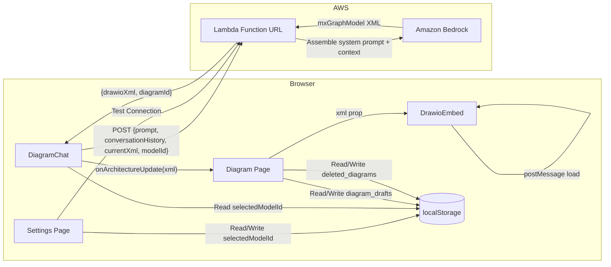

# Design Document: Chatbot Enhancements

## Overview

This design covers three integrated enhancements to the AWS Architecture Generator:

1. **Chatbot Rebuild** — Replace the broken DiagramChat component with a fully conversational AI assistant that maintains history, sends current XML context separately from the prompt, and updates diagrams in real-time via the Lambda Function URL.
2. **Soft-Delete Diagrams** — Add localStorage-based soft-delete with a "Deleted" section on the dashboard, restore capability, and 30-day auto-expiry.
3. **Settings Model Selection** — Expand the settings page with a Bedrock model dropdown, persist selection, propagate modelId to all Lambda requests, and provide a connection test button.

The key architectural decision is to keep prompt composition server-side (Lambda assembles system prompt + XML + user message) rather than client-side, avoiding prompt size limits in the browser payload.

## Architecture



### Data Flow — Chat Request

1. User types message in DiagramChat
2. DiagramChat reads `currentXml` from props (passed by parent page from DrawioEmbed's latest state)
3. DiagramChat reads `selectedModelId` from localStorage
4. DiagramChat sends POST to Lambda: `{ prompt, conversationHistory, currentXml, modelId }`
5. Lambda assembles full prompt: system prompt + currentXml context + user message
6. Lambda calls Bedrock with the selected model (or default if omitted)
7. Lambda extracts and validates mxGraphModel XML from response
8. Lambda returns `{ drawioXml, diagramId }`
9. DiagramChat invokes `onArchitectureUpdate(xml)` callback
10. Parent page updates state → DrawioEmbed receives new `xml` prop → reloads via postMessage

## Components and Interfaces

### DiagramChat Component (Rebuilt)

```typescript
interface ChatMessage {
  id: string;
  role: "user" | "assistant";
  content: string;
  timestamp: Date;
}

interface DiagramChatProps {
  currentXml?: string;
  onArchitectureUpdate?: (xml: string) => void;
  className?: string;
}

// Internal state
// - messages: ChatMessage[] (conversation history)
// - input: string
// - isLoading: boolean
// - error: string | null
```

**Key behaviors:**
- Maintains `messages` array as conversation history in component state
- Clears history when component unmounts (navigation away)
- Reads `selectedModelId` from localStorage on each request
- Truncates `currentXml` at 45,000 characters with a truncation note
- Disables input while request is in progress
- Shows loading indicator during fetch
- On success: adds assistant message, calls `onArchitectureUpdate`
- On error: adds error message, retains diagram state

### Lambda Request/Response Interface (Updated)

```typescript
// Request body (client → Lambda)
interface ChatRequest {
  prompt: string;                    // User's message only
  conversationHistory?: ChatMessage[]; // Prior messages for context
  currentXml?: string;               // Current diagram XML (may be truncated)
  modelId?: string;                  // Bedrock model ID override
}

// Response body (Lambda → client)
interface ChatResponse {
  drawioXml: string;                 // Complete mxGraphModel XML
  diagramId: string;                 // Generated diagram ID
}

// Error response
interface ChatErrorResponse {
  error: string;
  code: string;
  requestId: string;
}
```

### Lambda Handler Updates

The Lambda handler needs these changes:
1. Accept `conversationHistory`, `currentXml`, and `modelId` from request body
2. Assemble the full Bedrock messages array server-side:
   - System prompt (existing `buildSystemPrompt()`)
   - If `currentXml` provided: prepend as context in the user message
   - Include conversation history as alternating user/assistant messages
   - Append current user prompt as final message
3. If `modelId` provided, use it instead of the default `BEDROCK_MODEL_ID`
4. Keep existing retry logic, XML extraction, and validation

### Soft-Delete Storage Module

```typescript
interface DeletedDiagram {
  diagramId: string;
  name: string;
  xml: string;
  metadata?: Record<string, unknown>;
  deletedAt: string;   // ISO timestamp
  expiresAt: string;   // ISO timestamp (deletedAt + 30 days)
}

// localStorage keys
const DELETED_DIAGRAMS_KEY = "deleted_diagrams";
const DIAGRAM_DRAFTS_KEY = "diagram_drafts";

// Functions
function softDeleteDiagram(diagramId: string): void;
function restoreDiagram(diagramId: string): void;
function permanentlyDeleteDiagram(diagramId: string): void;
function purgeExpiredDiagrams(): void;
function getDeletedDiagrams(): DeletedDiagram[];
function getDaysUntilExpiry(diagram: DeletedDiagram): number;
```

### Settings Model Selection

```typescript
const SELECTED_MODEL_KEY = "selectedModelId";
const DEFAULT_MODEL_ID = "us.anthropic.claude-sonnet-4-5-20250929-v1:0";

interface ModelOption {
  id: string;          // Bedrock model ID
  label: string;       // Display name
}

const AVAILABLE_MODELS: ModelOption[] = [
  { id: "us.anthropic.claude-sonnet-4-5-20250929-v1:0", label: "Claude Sonnet 4" },
  { id: "us.anthropic.claude-3-5-haiku-20241022-v1:0", label: "Claude Haiku" },
  { id: "us.anthropic.claude-opus-4-20250514-v1:0", label: "Claude Opus" },
  { id: "us.amazon.nova-pro-v1:0", label: "Amazon Nova Pro" },
  { id: "us.amazon.nova-lite-v1:0", label: "Amazon Nova Lite" },
  { id: "us.meta.llama3-3-70b-instruct-v1:0", label: "Llama 3.3" },
  { id: "us.mistral.mistral-large-2411-v1:0", label: "Mistral Large" },
];

function getSelectedModelId(): string | null;
function setSelectedModelId(modelId: string): void;
```

## Data Models

### localStorage Schema

**`diagram_drafts`** (existing, unchanged):
```json
[
  {
    "diagramId": "string",
    "name": "string",
    "createdAt": "ISO-8601",
    "xml": "string",
    "spec": {}
  }
]
```

**`deleted_diagrams`** (new):
```json
[
  {
    "diagramId": "string",
    "name": "string",
    "xml": "string",
    "metadata": {},
    "deletedAt": "ISO-8601",
    "expiresAt": "ISO-8601"
  }
]
```

**`selectedModelId`** (new):
```json
"us.anthropic.claude-sonnet-4-5-20250929-v1:0"
```

### Lambda Request Body (Updated)

```json
{
  "prompt": "Add a WAF in front of the ALB",
  "conversationHistory": [
    { "role": "user", "content": "Create a 3-tier web app" },
    { "role": "assistant", "content": "Done! Added CloudFront, ALB, EC2, and RDS." }
  ],
  "currentXml": "<mxGraphModel>...</mxGraphModel>",
  "modelId": "us.anthropic.claude-sonnet-4-5-20250929-v1:0"
}
```

## Correctness Properties

*A property is a characteristic or behavior that should hold true across all valid executions of a system — essentially, a formal statement about what the system should do. Properties serve as the bridge between human-readable specifications and machine-verifiable correctness guarantees.*

### Property 1: Conversation history accumulates completely

*For any* sequence of N user messages sent to the chatbot, the request payload for the Nth message SHALL contain exactly N-1 prior messages in the conversationHistory field, all in chronological order with their original content preserved.

**Validates: Requirements 1.1, 1.2**

### Property 2: XML context is correctly bounded in payload

*For any* currentXml string, if its length is ≤ 45,000 characters, the request payload SHALL include it verbatim; if its length exceeds 45,000 characters, the payload SHALL include a truncated version of exactly 45,000 characters plus a truncation indicator note.

**Validates: Requirements 2.1, 2.3**

### Property 3: Request payload structure is always complete

*For any* combination of user prompt, conversation history, currentXml, and stored modelId, the constructed request payload SHALL contain all four fields (prompt, conversationHistory, currentXml, modelId) with correct types, where modelId is the value from localStorage or omitted if none stored.

**Validates: Requirements 3.1, 5.1, 10.1, 10.2, 10.3**

### Property 4: Successful response triggers callback with extracted XML

*For any* Lambda response containing a drawioXml field with valid mxGraphModel XML, the onArchitectureUpdate callback SHALL be invoked with exactly that XML string, and a new assistant message SHALL be added to the conversation history.

**Validates: Requirements 3.2, 4.1**

### Property 5: Soft-delete and restore is a lossless round trip

*For any* diagram with arbitrary name, XML content, and metadata, performing softDelete followed by restore SHALL result in the diagram appearing in the active drafts collection with all original fields (name, xml, metadata) identical to before deletion.

**Validates: Requirements 6.1, 6.2, 6.4, 6.5**

### Property 6: Expiry removes only diagrams older than 30 days

*For any* set of soft-deleted diagrams with varying deletion timestamps, running purgeExpiredDiagrams SHALL remove exactly those diagrams whose deletedAt is more than 30 days in the past, and retain all others. The getDaysUntilExpiry calculation for retained diagrams SHALL equal `30 - daysSinceDeletion`.

**Validates: Requirements 7.2, 7.4**

### Property 7: Model selection persistence round trip

*For any* valid model ID from the AVAILABLE_MODELS list, calling setSelectedModelId then getSelectedModelId SHALL return the same model ID. When no model is stored, getSelectedModelId SHALL return null.

**Validates: Requirements 8.2, 8.3, 8.4**

## Error Handling

| Scenario | Behavior |
|----------|----------|
| Lambda returns HTTP 4xx/5xx | Display error message from response body; retain current diagram state |
| Network failure (fetch throws) | Display "Network error — try again" with retry option; retain diagram |
| Lambda returns empty/malformed XML | Display "Could not update diagram" message; retain previous state |
| currentXml unavailable (null/undefined) | Send request without XML context; show info message to user |
| localStorage full (QuotaExceededError) | Catch error; show warning toast; operation degrades gracefully |
| Model not available in Bedrock | Lambda returns 503 MODEL_ACCESS_DENIED; settings page shows red indicator |
| Connection test timeout (30s) | Abort request; show red failure indicator with "Request timed out" |
| Conversation history exceeds token limits | Server-side: Lambda truncates oldest messages from history to fit context window |

## Testing Strategy

### Unit Tests (Vitest + Testing Library)

- **DiagramChat component**: Render with various props, verify message display, input behavior, loading states
- **Soft-delete module**: Test softDelete, restore, permanentDelete, purgeExpired with concrete examples
- **Settings page**: Test model selection rendering, persistence, test connection button states
- **Payload builder**: Test request construction with edge cases (empty XML, no history, no modelId)
- **Days-until-expiry calculation**: Test with concrete timestamps

### Property-Based Tests (fast-check + Vitest)

The project already uses `fast-check` (in devDependencies). Property-based tests will validate the correctness properties above.

**Configuration:**
- Minimum 100 iterations per property test
- Tag format: `Feature: chatbot-enhancements, Property {N}: {title}`

**Test targets:**
- `buildRequestPayload()` — pure function that constructs the Lambda request (Properties 1, 2, 3)
- `softDeleteDiagram()` / `restoreDiagram()` — localStorage operations (Property 5)
- `purgeExpiredDiagrams()` — expiry logic (Property 6)
- `getSelectedModelId()` / `setSelectedModelId()` — model persistence (Property 7)

### Integration Tests

- DiagramChat → Lambda mock: verify end-to-end flow from user input to diagram update
- Settings → Test Connection: verify request/response handling with mocked Lambda
- Dashboard → Deleted section: verify soft-deleted diagrams appear and restore works

### Manual Testing

- Verify Draw.io iframe updates correctly when XML changes via chatbot
- Verify conversation context improves LLM responses iteratively
- Test each Bedrock model via settings Test Connection
