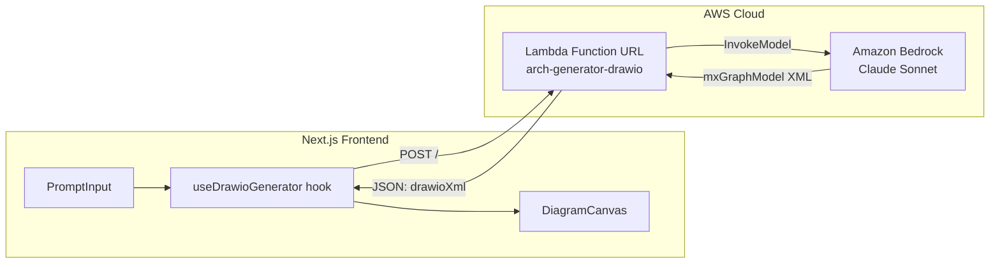

# Design Document: Lambda Draw.io Generator

## Overview

This feature adds a new Lambda function (`arch-generator-drawio`) that generates Draw.io XML directly from a user's architecture prompt using Claude Sonnet via Amazon Bedrock. Unlike the existing `generate` Lambda which produces intermediate JSON through API Gateway (29s timeout), this new Lambda uses a Function URL (15-minute timeout) and produces complete Draw.io `mxGraphModel` XML in a single LLM call.

The architecture is intentionally simple: Frontend → Function URL → Lambda → Bedrock → XML response. No API Gateway, no intermediate JSON-to-XML conversion step, no DynamoDB persistence at generation time.

### Key Design Decisions

1. **Function URL over API Gateway**: Removes the 29-second timeout constraint. Function URLs support up to 15 minutes, matching Lambda's max execution time.
2. **Direct XML generation**: The LLM produces final Draw.io XML directly, eliminating the render Lambda step. A well-crafted system prompt with shape mappings and examples ensures consistent output.
3. **AuthType.NONE**: Simplifies deployment for this MVP. The Function URL is publicly accessible with CORS configured.
4. **Separate Lambda**: This is a new function alongside the existing `generate` Lambda, not a replacement. Both coexist in the same CDK stack.

## Architecture



### Request Flow

1. User enters an architecture prompt in the frontend
2. `useDrawioGenerator` hook sends POST to the Function URL
3. Lambda validates the request (prompt length, format)
4. Lambda invokes Bedrock with the system prompt + user prompt
5. Lambda extracts `<mxGraphModel>...</mxGraphModel>` from the LLM response
6. Lambda validates the XML is well-formed
7. Lambda returns `{ drawioXml, diagramId }` to the frontend
8. Frontend passes `drawioXml` to `DiagramCanvas` for rendering

### Infrastructure Additions to CDK Stack

The following resources are added to `ArchGeneratorStack`:

- **NodejsFunction** (`arch-generator-drawio`): Node.js 22.x, 1024 MB memory, 900s timeout
- **FunctionUrl**: AuthType.NONE, CORS `*`, methods POST + OPTIONS
- **IAM Policy**: `bedrock:InvokeModel` + `bedrock:InvokeModelWithResponseStream` on `arn:aws:bedrock:*::foundation-model/anthropic.*`
- **CfnOutput** (`DrawioGeneratorFunctionUrl`): Exports the Function URL

## Components and Interfaces

### 1. Lambda Handler (`infrastructure/lambda/drawio-generator/index.ts`)

```typescript
// Entry point - exported handler
export const handler = async (event: LambdaFunctionURLEvent): Promise<LambdaFunctionURLResponse>

// Internal functions
function validateRequest(event: LambdaFunctionURLEvent): { prompt: string } | ErrorResponse
function callBedrockWithRetry(prompt: string): Promise<string>
function extractDrawioXml(llmResponse: string): string | null
function buildSystemPrompt(): string
```

**Event type**: `LambdaFunctionURLEvent` (different from API Gateway events — uses `requestContext.http.method` instead of `httpMethod`).

**Response shape (success)**:
```json
{
  "statusCode": 200,
  "headers": { "Content-Type": "application/json", "Access-Control-Allow-Origin": "*", ... },
  "body": "{\"drawioXml\": \"<mxGraphModel>...</mxGraphModel>\", \"diagramId\": \"drawio-1234567890-abc\"}"
}
```

**Response shape (error)**:
```json
{
  "statusCode": 400|422|500|502|503,
  "headers": { ... },
  "body": "{\"error\": \"...\", \"code\": \"INVALID_PROMPT|INVALID_XML|LLM_ERROR|MODEL_ACCESS_DENIED|INTERNAL_ERROR\", \"requestId\": \"...\"}"
}
```

### 2. Frontend Service (`src/services/drawio-generator.ts`)

```typescript
export interface DrawioGenerateRequest {
  prompt: string;
}

export interface DrawioGenerateResponse {
  drawioXml: string;
  diagramId: string;
}

export interface DrawioGenerateError {
  error: string;
  code?: string;
  requestId?: string;
}

export async function generateDrawioXml(request: DrawioGenerateRequest): Promise<DrawioGenerateResponse>
```

This service:
- Reads `NEXT_PUBLIC_DRAWIO_GENERATOR_URL` from environment
- Sends a POST with `{ prompt }` body and `Content-Type: application/json`
- Uses `AbortController` with a 900-second timeout
- Throws typed errors for HTTP 4xx/5xx responses

### 3. React Hook (`src/hooks/useDrawioGenerator.ts`)

```typescript
export interface UseDrawioGeneratorReturn {
  generate: (prompt: string) => Promise<void>;
  drawioXml: string | null;
  diagramId: string | null;
  isGenerating: boolean;
  error: DrawioGenerateError | null;
  reset: () => void;
}

export function useDrawioGenerator(): UseDrawioGeneratorReturn
```

This hook:
- Manages loading/error/success states
- Disables duplicate submissions while generating
- Provides the generated XML for `DiagramCanvas`
- Integrates with the existing toast notification system for errors

### 4. CDK Additions (`infrastructure/lib/arch-generator-stack.ts`)

New code added after the existing `generateFn` definition:

```typescript
// Draw.io Generator Lambda (Function URL, no API Gateway)
const drawioGeneratorFn = new lambdaNodejs.NodejsFunction(this, 'DrawioGeneratorLambda', {
  functionName: 'arch-generator-drawio',
  entry: 'lambda/drawio-generator/index.ts',
  handler: 'handler',
  runtime: lambda.Runtime.NODEJS_22_X,
  timeout: cdk.Duration.seconds(900),
  memorySize: 1024,
  environment: {
    BEDROCK_MODEL_ID: 'us.anthropic.claude-sonnet-4-5-20250929-v1:0',
    BEDROCK_REGION: 'us-east-1',
  },
  bundling: { minify: false, sourceMap: true, externalModules: [] },
});

// Bedrock permissions
drawioGeneratorFn.addToRolePolicy(new iam.PolicyStatement({
  actions: ['bedrock:InvokeModel', 'bedrock:InvokeModelWithResponseStream'],
  resources: ['arn:aws:bedrock:*::foundation-model/anthropic.*'],
}));

// Function URL with CORS
const drawioFunctionUrl = drawioGeneratorFn.addFunctionUrl({
  authType: lambda.FunctionUrlAuthType.NONE,
  cors: {
    allowedOrigins: ['*'],
    allowedMethods: [lambda.HttpMethod.POST],
    allowedHeaders: ['Content-Type'],
  },
});

new cdk.CfnOutput(this, 'DrawioGeneratorFunctionUrl', {
  value: drawioFunctionUrl.url,
  description: 'Function URL for the Draw.io XML generator Lambda',
});
```

### 5. System Prompt Module (`infrastructure/lambda/drawio-generator/system-prompt.ts`)

Separate module exporting the system prompt string. Contains:
- mxGraphModel XML structure boilerplate
- AWS service → `shape=mxgraph.aws4.*` mapping table
- Container patterns (VPC, subnet, AZ) with swimlane style
- Edge styling rules (orthogonal routing, colors)
- Node sizing and spacing rules
- A reference example XML snippet
- Instructions to output raw XML only (no markdown fences)

## Data Models

### Lambda Function URL Event (Input)

```typescript
interface LambdaFunctionURLEvent {
  requestContext: {
    http: {
      method: string;  // "POST", "OPTIONS", etc.
      path: string;
      sourceIp: string;
    };
    requestId: string;  // Used for error traceability
  };
  headers: Record<string, string>;
  body?: string;
  isBase64Encoded: boolean;
}
```

### Lambda Function URL Response (Output)

```typescript
interface LambdaFunctionURLResponse {
  statusCode: number;
  headers: Record<string, string>;
  body: string;  // JSON-stringified
}
```

### Request Body

```typescript
interface DrawioGenerateRequestBody {
  prompt: string;  // 10-5000 characters
}
```

### Success Response Body

```typescript
interface DrawioSuccessResponse {
  drawioXml: string;   // Complete <mxGraphModel>...</mxGraphModel> XML
  diagramId: string;   // Format: "drawio-{timestamp}-{random}"
}
```

### Error Response Body

```typescript
interface DrawioErrorResponse {
  error: string;       // Human-readable error message
  code: string;        // Machine-readable: INVALID_PROMPT | INVALID_XML | LLM_ERROR | MODEL_ACCESS_DENIED | INTERNAL_ERROR | METHOD_NOT_ALLOWED
  requestId: string;   // From Lambda context for traceability
}
```

### AWS Shape Mapping (subset)

```typescript
const AWS_SHAPE_MAP: Record<string, string> = {
  'lambda': 'mxgraph.aws4.lambda_function',
  'ec2': 'mxgraph.aws4.ec2',
  's3': 'mxgraph.aws4.s3',
  'dynamodb': 'mxgraph.aws4.dynamodb',
  'api-gateway': 'mxgraph.aws4.api_gateway',
  'cloudfront': 'mxgraph.aws4.cloudfront',
  'rds': 'mxgraph.aws4.rds',
  'sqs': 'mxgraph.aws4.sqs',
  'sns': 'mxgraph.aws4.sns',
  'ecs': 'mxgraph.aws4.ecs',
  'eks': 'mxgraph.aws4.eks',
  'vpc': 'mxgraph.aws4.vpc',
  'elb': 'mxgraph.aws4.elb',
  'alb': 'mxgraph.aws4.application_load_balancer',
  'cognito': 'mxgraph.aws4.cognito',
  'kinesis': 'mxgraph.aws4.kinesis',
  'step-functions': 'mxgraph.aws4.step_functions',
  'eventbridge': 'mxgraph.aws4.eventbridge',
  'route53': 'mxgraph.aws4.route_53',
  'waf': 'mxgraph.aws4.waf',
  'cloudwatch': 'mxgraph.aws4.cloudwatch',
  // ... full registry in system-prompt.ts
};
```


## Correctness Properties

*A property is a characteristic or behavior that should hold true across all valid executions of a system — essentially, a formal statement about what the system should do. Properties serve as the bridge between human-readable specifications and machine-verifiable correctness guarantees.*

### Property 1: XML extraction preserves content

*For any* valid mxGraphModel XML string wrapped in arbitrary surrounding text (markdown fences, explanatory paragraphs, leading/trailing whitespace), the `extractDrawioXml` function SHALL extract exactly the content from `<mxGraphModel` to `</mxGraphModel>` inclusive, producing the same XML that was embedded.

**Validates: Requirements 2.3**

### Property 2: Retry logic respects retry budget and backoff

*For any* sequence of Bedrock invocation results (where each result is either success, retryable error, or non-retryable error), the `callBedrockWithRetry` function SHALL: (a) make at most 3 total attempts, (b) return immediately on success or non-retryable error, (c) wait exponentially (1s, 2s) between retryable failures, and (d) return the final error if all attempts are exhausted.

**Validates: Requirements 2.5, 5.2, 5.4**

### Property 3: XML validation accepts valid and rejects invalid

*For any* string, the XML validation function SHALL accept it if and only if it is well-formed XML with a single `<mxGraphModel>` root element. When rejected, the Lambda response SHALL never contain any fragment of the invalid XML in the response body.

**Validates: Requirements 2.8, 3.9, 5.3**

### Property 4: Invalid request bodies are rejected with HTTP 400

*For any* request body that is either not valid JSON, or valid JSON missing a `prompt` field, or has a `prompt` that is not a string, the Lambda SHALL return HTTP 400 with a JSON body containing an `error` field.

**Validates: Requirements 4.1, 4.2, 4.3**

### Property 5: Prompt length boundaries are enforced

*For any* string prompt shorter than 10 characters or longer than 5000 characters, the Lambda SHALL return HTTP 400 with an error message indicating the length constraint. *For any* string prompt between 10 and 5000 characters inclusive with a valid JSON wrapper, the Lambda SHALL NOT reject based on length.

**Validates: Requirements 4.3, 4.4**

### Property 6: Success responses contain required fields

*For any* successful generation (mocked Bedrock returning valid mxGraphModel XML), the Lambda response SHALL have HTTP 200, and the response body SHALL contain a non-empty `drawioXml` string field and a non-empty `diagramId` string field.

**Validates: Requirements 4.5**

### Property 7: All responses include CORS headers and error responses include structured fields

*For any* request to the Lambda (valid or invalid), the response SHALL include `Access-Control-Allow-Origin: *`, `Access-Control-Allow-Methods`, and `Access-Control-Allow-Headers` headers. Additionally, *for any* non-200 response, the body SHALL contain `requestId`, `error`, and `code` string fields.

**Validates: Requirements 4.6, 5.6**

### Property 8: Unsupported HTTP methods are rejected

*For any* HTTP method that is not POST and not OPTIONS, the Lambda SHALL return HTTP 405 with an error indicating the method is not allowed.

**Validates: Requirements 4.8**

### Property 9: Unexpected errors produce generic responses

*For any* error thrown during processing that is not a recognized Bedrock error type (AccessDeniedException, ThrottlingException, ServiceUnavailableException, ModelTimeoutException), the Lambda SHALL return HTTP 500 with the message "Internal server error" and SHALL NOT include the original error message or stack trace in the response body.

**Validates: Requirements 5.5**

## Error Handling

### Error Classification

| Error Type | HTTP Status | Code | Retryable | Source |
|---|---|---|---|---|
| Missing/invalid JSON body | 400 | `INVALID_REQUEST` | No | Request validation |
| Prompt too short (<10 chars) | 400 | `INVALID_PROMPT` | No | Request validation |
| Prompt too long (>5000 chars) | 400 | `INVALID_PROMPT` | No | Request validation |
| Method not allowed | 405 | `METHOD_NOT_ALLOWED` | No | Request validation |
| Bedrock AccessDeniedException | 503 | `MODEL_ACCESS_DENIED` | No | Bedrock |
| Bedrock ThrottlingException | 502 | `LLM_ERROR` | Yes (auto) | Bedrock |
| Bedrock ServiceUnavailableException | 502 | `LLM_ERROR` | Yes (auto) | Bedrock |
| Bedrock timeout (60s) | 502 | `LLM_ERROR` | Yes (auto) | Bedrock |
| LLM output not valid XML | 422 | `INVALID_XML` | No | Response validation |
| Unexpected error | 500 | `INTERNAL_ERROR` | No | Any |

### Retry Strategy

```
Attempt 1 → fail (retryable) → wait 1s
Attempt 2 → fail (retryable) → wait 2s  
Attempt 3 → fail → return HTTP 502 with LLM_ERROR
```

Non-retryable errors (AccessDeniedException, model not found) immediately return without retry.

### Error Response Shape

All error responses follow the same structure:

```json
{
  "error": "Human-readable error description",
  "code": "MACHINE_READABLE_CODE",
  "requestId": "lambda-request-id-from-context"
}
```

### Logging

- All errors are logged to CloudWatch with: error message, stack trace (for unexpected errors), request context (prompt length, method, source IP)
- Successful requests log: prompt length, generation duration, diagram ID
- No PII or prompt content is logged

### Frontend Error Handling

The `useDrawioGenerator` hook categorizes errors for UI presentation:

| Code | User Message | Action |
|---|---|---|
| `INVALID_PROMPT` | Shown as form validation error | User corrects prompt |
| `MODEL_ACCESS_DENIED` | "Service temporarily unavailable" | Retry later |
| `LLM_ERROR` | "Generation failed, please try again" | Retry button |
| `INVALID_XML` | "Generation produced invalid output, please try again" | Retry button |
| `INTERNAL_ERROR` | "Something went wrong" | Retry button |
| Network error | "Network error, check your connection" | Retry button |
| Timeout (900s) | "Request timed out" | Retry button |

## Testing Strategy

### Unit Tests (Vitest)

Tests for the Lambda handler logic with mocked Bedrock client:

- **Request validation**: Verify all invalid request permutations return correct error responses
- **XML extraction**: Verify extraction from various LLM response formats
- **XML validation**: Verify acceptance/rejection of well-formed vs malformed XML
- **Error mapping**: Verify each Bedrock error type maps to the correct HTTP response
- **CORS headers**: Verify presence in all response paths
- **System prompt content**: Verify shape mappings, structure, and examples are present

Tests for the frontend service:
- **Service function**: Verify correct fetch construction, timeout, and error handling
- **Hook state management**: Verify loading, success, and error state transitions
- **Environment variable handling**: Verify behavior when URL is/isn't configured

### Property-Based Tests (fast-check + Vitest)

The project already has `fast-check` as a dev dependency. Property tests target:

- **Property 1**: Generate random XML wrapped in random surrounding text → extraction correctness
- **Property 2**: Generate random success/failure sequences → retry behavior
- **Property 3**: Generate random strings → XML validation accepts/rejects correctly
- **Property 4**: Generate random JSON bodies → request validation
- **Property 5**: Generate random-length strings → prompt length enforcement
- **Property 6**: Mock valid responses → success response structure
- **Property 7**: Generate random requests → CORS headers always present
- **Property 8**: Generate random HTTP methods → 405 for non-POST/OPTIONS
- **Property 9**: Generate random Error objects → generic 500 response

Each property test runs a minimum of 100 iterations. Tests are tagged with:
```
// Feature: lambda-drawio-generator, Property N: <property text>
```

### Integration Tests

Run against deployed infrastructure (separate from unit tests):
- End-to-end generation with real Bedrock call
- Verify AWS icon shapes appear in output
- Verify container nesting for VPC/subnet prompts
- Verify response times for various prompt complexities

### CDK Snapshot/Assertion Tests

- Verify synthesized CloudFormation template contains expected resources
- Verify Lambda configuration (runtime, timeout, memory, environment)
- Verify Function URL CORS configuration
- Verify IAM policy scope
