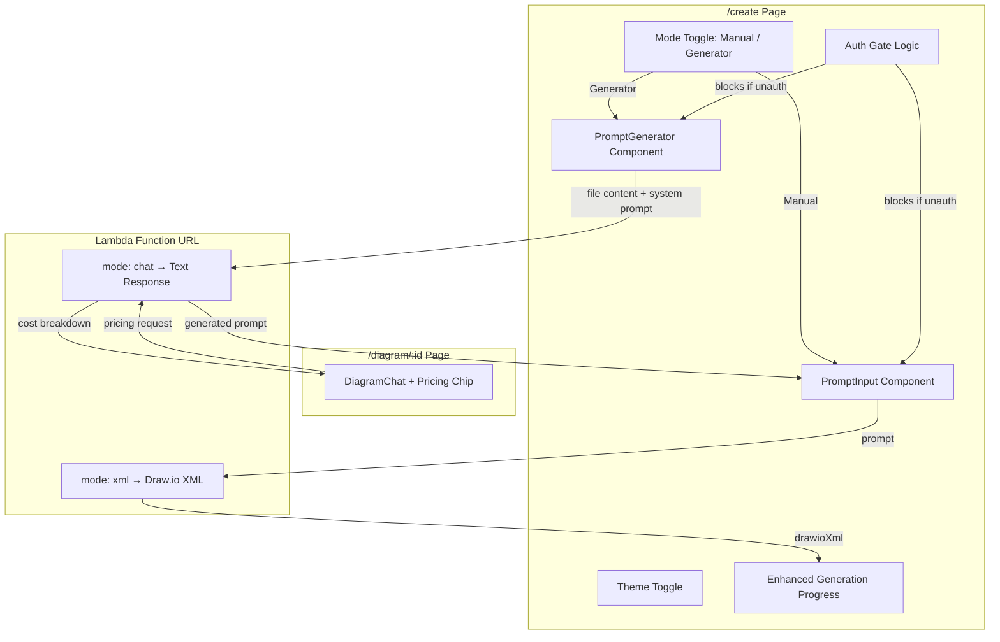

# Design Document: Prompt Generator and UX Enhancements

## Overview

This feature introduces six coordinated improvements to the AWS Architecture Generator's Create Page and Chatbot experience:

1. **Auth Gate** — Remove server-side redirect for `/create`, allow unauthenticated browsing, and gate protected actions (generate, file upload) behind client-side auth checks with toast warnings.
2. **Enhanced Generation Progress UI** — Replace the basic spinner with a multi-step animated progress experience including shimmer skeleton, elapsed timer, and smooth transitions.
3. **Prompt Generator Mode** — Add a toggle between "Manual Prompt" and "Prompt Generator" that enables file upload (.csv, .xlsx, .pdf, .txt, .json, .eml) and text paste, sending content to Lambda for AI-generated architecture prompts.
4. **Template Section Removal** — Remove the template selector from the Create Page while preserving the /templates page and navigation link.
5. **Pricing Calculator Chip** — Add "Get AWS Pricing Estimate" to the DiagramChat suggestion chips, sending current XML for cost analysis.
6. **Theme Toggle** — Add a Sun/Moon theme toggle button to the Create Page top-right corner using next-themes.

The design prioritizes minimal new dependencies (the project already has shadcn/ui, next-themes, lucide-react, radix-toast) and leverages the existing Lambda Function URL's `mode: "chat"` capability for the Prompt Generator.

## Architecture



### Key Architecture Decisions

| Decision | Choice | Rationale |
|----------|--------|-----------|
| Auth gating approach | Client-side via `useAuth` hook | Avoids middleware complexity; page content remains visible for SEO/discovery; only actions are gated |
| Middleware change | Remove `/create` from `PROTECTED_ROUTES` | Simplest change — one line edit in middleware.ts |
| File reading strategy | `FileReader.readAsText()` for all types | Lambda (Claude) can interpret CSV, JSON, TXT, EML as text. For PDF/XLSX, send raw text and let LLM extract meaning |
| Prompt Generator AI call | Reuse existing Lambda with `mode: "chat"` + system instruction | No new backend needed; the Lambda already routes chat-mode to conversational Claude |
| Progress animation | CSS-only (keyframes, transitions) | No JS animation loops; performant and accessible with `prefers-reduced-motion` |
| Toast library | Existing `@radix-ui/react-toast` (shadcn/ui) | Already installed; consistent with UI design system |

## Components and Interfaces

### 1. Auth Gate (Middleware + Client-Side)

**Middleware change** (`src/middleware.ts`):
```typescript
// Remove '/create' from PROTECTED_ROUTES
const PROTECTED_ROUTES = ['/diagram', '/templates', '/settings', '/diagrams', '/import'];
```

**Client-side hook** (`src/hooks/useAuthGate.ts`):
```typescript
interface UseAuthGateReturn {
  /** Wraps an action — shows toast if unauth, executes if auth */
  guardAction: (action: () => void | Promise<void>) => void;
  isAuthenticated: boolean;
}
```

### 2. Enhanced Generation Progress UI

**Component**: `src/components/create/GenerationProgress.tsx` (refactored)

New features added to existing component:
- Skeleton diagram placeholder with shimmer animation
- Step labels update: "Interpreting prompt..." → "Generating architecture..." → "Rendering diagram..."
- CSS transition between steps (max 300ms via `transition-all duration-300`)
- Pulse progress bar (already partially exists via `animate-pulse-slide`)

### 3. Prompt Generator Component

**New component**: `src/components/create/PromptGenerator.tsx`

```typescript
interface PromptGeneratorProps {
  /** Called when AI generates a prompt, populates the main textarea */
  onPromptGenerated: (prompt: string) => void;
  /** Whether generation is in progress (disables inputs) */
  isDisabled?: boolean;
}
```

**File validation utility**: `src/lib/validation/file-validation.ts`

```typescript
interface FileValidationResult {
  valid: boolean;
  error?: string;
}

const ACCEPTED_EXTENSIONS = ['.csv', '.xlsx', '.pdf', '.txt', '.json', '.eml'];
const MAX_FILE_SIZE_BYTES = 5 * 1024 * 1024; // 5MB

function validateFile(file: File): FileValidationResult;
```

### 4. Mode Toggle on Create Page

Uses `@radix-ui/react-tabs` (already installed) for the Manual/Generator switch at the top of the prompt section.

```typescript
type CreateMode = 'manual' | 'generator';
// State lives in CreateDiagramContent, prompt text is shared across modes
```

### 5. Pricing Calculator Chip (DiagramChat)

**Change to** `src/components/diagram/DiagramChat.tsx`:

```typescript
// Add to SUGGESTION_CHIPS array
{ label: "Get AWS Pricing Estimate", mode: "chat" as const }
```

The pricing chip sends a message with a pricing-specific system instruction prepended:
```
Analyze the AWS services in this architecture diagram and provide:
1. A list of inferred services with estimated instance sizes
2. Estimated monthly cost per service
3. Total estimated monthly cost
4. A link to https://calculator.aws for detailed pricing
```

When `currentXml` is empty/null, display: "Please generate a diagram first to get a pricing estimate."

### 6. Theme Toggle Component

**New component**: `src/components/create/ThemeToggle.tsx`

```typescript
// Simple button using useTheme() from next-themes
// Renders Sun icon in dark mode, Moon icon in light mode
// Positioned absolute top-right in CreatePage layout
```

## Data Models

### File Validation Types

```typescript
// src/lib/validation/file-validation.ts
interface FileValidationResult {
  valid: boolean;
  error?: string;
}

interface ParsedFileContent {
  filename: string;
  extension: string;
  content: string;
  sizeBytes: number;
}
```

### Prompt Generator Request Payload

```typescript
// Sent to Lambda Function URL
interface PromptGeneratorPayload {
  prompt: string;           // System instruction for prompt generation
  mode: 'chat';
  conversationHistory: [];  // Empty — single-shot
  // Content is embedded in the prompt field:
  // "Given the following infrastructure inventory/document, generate a detailed AWS architecture description: \n\n<content>"
}
```

### Auth Gate State

```typescript
// No new data model — uses existing AuthContextValue from useAuth()
// isAuthenticated: boolean is the only state needed
```

## Correctness Properties

*A property is a characteristic or behavior that should hold true across all valid executions of a system — essentially, a formal statement about what the system should do. Properties serve as the bridge between human-readable specifications and machine-verifiable correctness guarantees.*

### Property 1: Auth gate blocks Lambda requests for unauthenticated users

*For any* prompt string submitted through the Generate Diagram flow, if the user is unauthenticated, the system shall not invoke the Lambda Function URL and shall instead display a toast warning.

**Validates: Requirements 1.4**

### Property 2: File extension validation correctness

*For any* file, if its extension is in the set {.csv, .xlsx, .pdf, .txt, .json, .eml} then `validateFile` shall return `{ valid: true }`. *For any* file whose extension is NOT in that set, `validateFile` shall return `{ valid: false }` with an error message listing accepted types.

**Validates: Requirements 3.3, 3.5**

### Property 3: File size validation enforces the 5MB limit

*For any* file with size greater than 5,242,880 bytes, `validateFile` shall return `{ valid: false }` with a size limit error. *For any* file with size less than or equal to 5,242,880 bytes (and a valid extension), `validateFile` shall return `{ valid: true }`.

**Validates: Requirements 3.4**

### Property 4: Mode toggle preserves prompt text

*For any* non-empty string in the prompt textarea, switching from "Manual Prompt" to "Prompt Generator" and back (or vice versa) shall preserve that string unchanged in the textarea.

**Validates: Requirements 3.10**

## Error Handling

| Scenario | Behavior |
|----------|----------|
| Unauthenticated action attempt | Toast warning (yellow/destructive variant), action blocked, no network call |
| File exceeds 5MB | Inline error below upload area: "File exceeds the 5MB size limit" |
| Unsupported file extension | Inline error: "Unsupported file type. Accepted: .csv, .xlsx, .pdf, .txt, .json, .eml" |
| Prompt Generator Lambda call fails | Error message in generator area: "Failed to analyze content. Please try again." with retry option |
| Pricing chip with no diagram XML | Chat message: "Please generate a diagram first to get a pricing estimate." |
| File read error (corrupt/unreadable) | Inline error: "Unable to read file. Please try a different file." |
| Lambda timeout during prompt generation | Show timeout error with retry button after 30 seconds |

## Testing Strategy

### Unit Tests (example-based)

- **Auth Gate**: Verify toast appears on generate click when unauthenticated; verify page renders without redirect
- **Generation Progress UI**: Verify step labels render in sequence; verify skeleton element present; verify elapsed timer increments
- **Prompt Generator**: Verify toggle switches modes; verify file upload triggers correct payload; verify generated prompt populates textarea
- **Template Removal**: Verify template section absent from Create Page; verify /templates link persists
- **Pricing Chip**: Verify chip renders; verify payload includes XML and pricing instruction; verify error message when no XML
- **Theme Toggle**: Verify correct icon per theme; verify `setTheme` called on click

### Property-Based Tests (fast-check, 100+ iterations)

| Property | Test |
|----------|------|
| Property 1: Auth gate blocks requests | Generate random prompts, mock unauthenticated state, assert no fetch call made |
| Property 2: File extension validation | Generate random filenames with valid/invalid extensions, assert correct accept/reject |
| Property 3: File size validation | Generate random file sizes around the 5MB boundary, assert correct accept/reject |
| Property 4: Mode toggle preserves text | Generate random strings, simulate mode switches, assert text preserved |

**Configuration**:
- Library: `fast-check` (already in devDependencies)
- Minimum iterations: 100 per property
- Tag format: `Feature: prompt-generator-and-ux, Property {N}: {description}`

### Integration Tests

- **Pricing flow end-to-end**: Verify clicking pricing chip with real XML sends correct payload shape to Lambda mock
- **Prompt Generator flow**: Verify file upload → Lambda call → textarea population pipeline
- **Middleware behavior**: Verify `/create` accessible without auth cookies; verify `/diagram` still redirects
